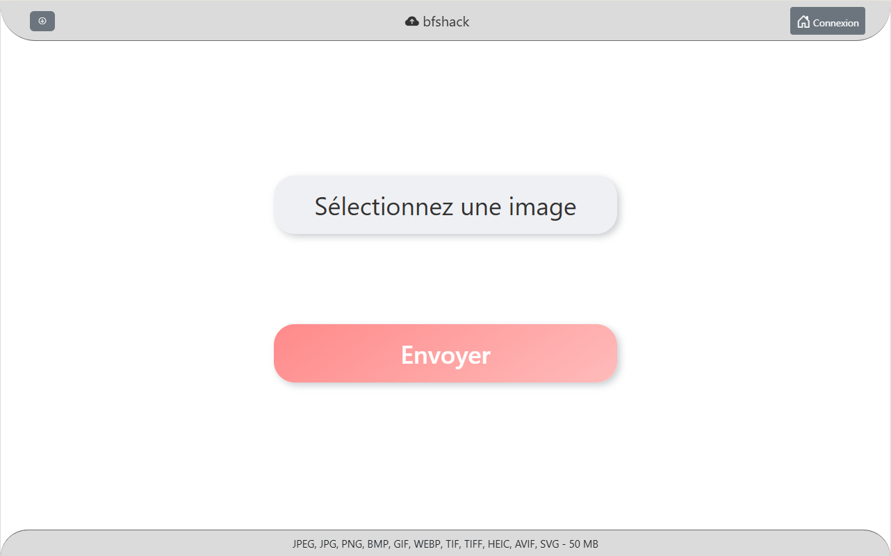

# 📸 bfshack 

**bfshack** est une plateforme web d'hébergement d'images conçue pour offrir une expérience simple, rapide et sécurisée.

Développée dans le cadre de ma reconversion en développement informatique, ce projet vise à démontrer mes compétences en conception de solutions web.

## 🖼 Aperçu du site

Voici un aperçu de l’interface utilisateur de **bfshack** :

## 🔗 Accès au projet

👉 [bfshack](http://195.154.164.26/bfshack/)

## 📝 Sommaire

- [À propos du projet](#-à-propos-du-projet)
- [Fonctionnalités principales](#-fonctionnalités-principales)
- [Architecture technique](#-architecture-technique)
- [Sécurité et bonnes pratiques](#-sécurité-et-bonnes-pratiques)
- [Améliorations futures](#-améliorations-futures)
- [Contact](#-contact)

## 📖 À propos du projet

bfshack propose un espace où les utilisateurs peuvent uploader des images de grande taille et les consulter via une interface simple.

 Objectifs pédagogiques :

- Développer un projet web full-stack.
- Manipuler les langages de création de site web : HTML, CSS, JavaScript.
- Utiliser Bootstrap pour créer une interface responsive et moderne.
- Développer un backend en PHP pour le traitement serveur.
- Gérer une base de données relationnelle avec MariaDB.
- Appliquer les bonnes pratiques de sécurité sur les données utilisateurs.
- Déployer et configurer un serveur Linux Debian 12 pour un hébergement web.
- Mettre en production un projet personnel accessible en ligne.

## 🚀 Fonctionnalités principales

- Upload d'images de grande taille via un formulaire sécurisé.
- Stockage local des images sur le serveur.
- Visualisation immédiate de l'image uploadée.
- Interface responsive compatible mobile / tablette.
- Gestion des erreurs côté client et serveur.
- Gestion de comptes utilisateurs.

## 🏗 Architecture technique

- **Frontend** :  HTML, CSS, Bootstrap, JavaScript
- **Backend** : PHP, MariaDB

## 🔒 Sécurité et bonnes pratiques

- Validation côté serveur des types de fichiers acceptés.
- Limitation de la taille maximale des fichiers uploadés.
- Génération d'un nom de fichier unique pour éviter les doublons.
- Stockage sécurisé des chemins d'accès aux images dans la base de données.
- Fichier `.env` utilisé pour séparer les paramètres sensibles (connexion base de données).
- Dépôt Git configuré avec un `.gitignore` pour protéger le `.env` et autres fichiers sensibles.
- Interface administrateur complète avec visualisation des logs, des comptes utilisateurs, des images hébergées.

## 🚧 Améliorations futures

- **Gestion des comptes utilisateurs** : Accès à une galerie d'image déjà mise en ligne de l'utilisateur.
- **Upload d'image** : Aperçu de l'image envoyée pendant la mise en ligne.
- **Upload d'images multiples** : Possibilité d'héberger plusieurs images en même temps.
- **Information pendant l'upload** : Ajout d'une barre de chargement pour indiquer la progression de l'envoi de l'image.
- **Panel administrateur** : Ajout d'un compteur d'images pour avoir connaissance du nombre total d'images hébergées.
- **Panel administrateur** : Ajout d'un système de pages pour la navigation dans le panel administrateur.

## 📫 Contact

N'hésitez pas à me contacter pour échanger :

- ✉️ Email : renzacci.flavien@gmail.com
- 💼 LinkedIn : [Mon profil LinkedIn](https://www.linkedin.com/in/flavien-renzacci-3b4b7217a/)

